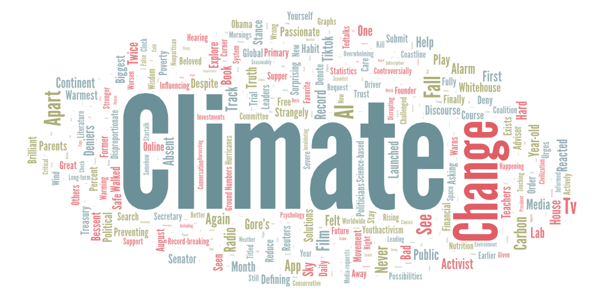
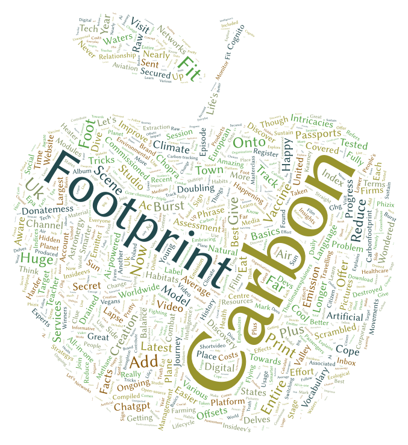
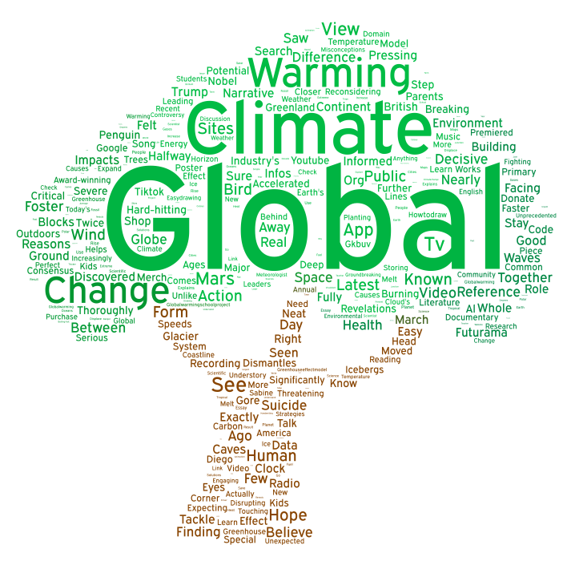

# Climate Change Discourse

**Author:**  
Jiali Deng  

## I. Topic and Parameters

In this project I am examining how climate related issues are discussed on Youtube by analyzing video descriptions associated with three keywords: **“climate change,” “carbon footprint,” and “global warming.”** Using these keywords to collect data, I generated word clouds to visualize the most frequently occurring words connected to each topic. 

## II. Goal
The goal of my analysis was to explore how different climate related terms emphasize certain narratives, responsibilities, and areas of concern within environmental discourse on YouTube.

## III. Word Cloud Comparison
The **climate change** word cloud is dominated by broad and institutional terms such as *climate*, *change*, *public*, *action*, and *environment*. This suggests a framing that emphasizes collective responsibility, policy discussions, and large scale environmental systems. The presence of words related to organizations, media, and research reflects how climate change is often discussed at a global or governmental level, with strong political undertones supported by references to public figures and controversy.

The **carbon footprint** word cloud stands out for its emphasis on *carbon*, *emissions*, *footprint*, *reduce*, and *offsets*. Unlike the other two, this word cloud highlights individual actions, technology, consumption, and measurement. The language reflects an action oriented and educational approach, focusing on personal responsibility, technology enabled measurement tools, and practical steps individuals can implement to minimize their environmental impact.

The **global warming** word cloud places strong emphasis on *warming*, *temperature*, *effects*, and *health*. Compared to climate change, this word cloud appears more focused on physical impacts and consequences. Terms related to nature, severity, and urgency hint at the fact that global warming discourse may be more emotionally driven and centered on visible environmental change.

## IV. Possible Reasons for Observed Patterns

The differences between the word clouds likely stem from how each keyword is used in public discourse. *Climate change* is frequently discussed in scientific research, news media, and policy debates. *Carbon footprint* is often used in discussions about personal responsibility, sustainability tools, and corporate practices, and *global warming* emphasizes physical temperature increases and its respective consequences. 

## V. Future Improvements

My research could be improved by expanding the dataset to include a larger sample of videos per search term and incorporating data from multiple platforms beyond YouTube, such as TikTok, Instagram, and Twitter. This would provide a more comprehensive understanding of how climate discourse varies across different social media outlets and audience demographics, revealing whether the patterns observed are specific to Youtube or reflect broader trends in online climate communication.

## VI. Unexpected Findings

One unexpected finding was how strongly the **carbon footprint** word cloud focused on individual and technological solutions, compared to the broader systemic framing seen in **climate change**. I initially expected more overlap among the three word clouds, but the differences revealed how framing significantly shapes the narrative. The **global warming** word cloud also appeared more impact focused than I originally thought.

## Spreadsheets URLs

The CSV files containing the collected and processed data can be downloaded here:

- [Search Result 1: Climate Change](https://docs.google.com/spreadsheets/d/1iO0brx1qmbRq2MQ9jI-VFJarNvZZEfTHiw24hjMuc7E/edit?gid=53119700#gid=53119700)
- [Search Result 2: Carbon Footprint](https://docs.google.com/spreadsheets/d/1LZF9kh7yj4Ap2K9mKyLUewMZkNzcemhusIl2KRlD0Io/edit?gid=1990895915#gid=1990895915)
- [Search Result 3: Global Warming](https://docs.google.com/spreadsheets/d/1L4y0fiXUZp-gZlIi5tp4V6MyyqF7b4dkMXuZe3WW_Wg/edit?gid=1783720688#gid=1783720688)